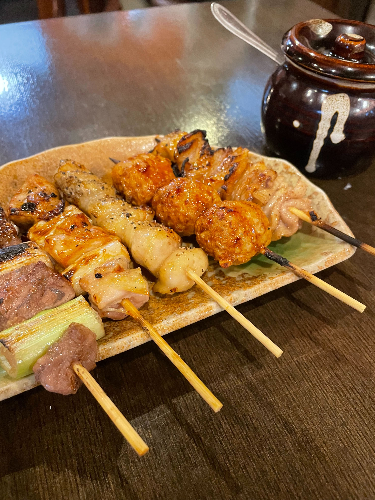

# やきとりひびき 東松山駅前本店

日本三大焼き鳥

席数少なめ、17時過ぎに訪問したが残り1席、他は予約で埋まっていた

[やきとりひびき 東松山駅前本店 \(東松山/焼鳥\)](https://tabelog.com/saitama/A1105/A110502/11005020/)

日本酒の帝松に「東松山」という地酒があり、それを扱っていた

串は早めの注文を心がけた方が良い、届くまでにお通しとビールと日本酒１合が空く

